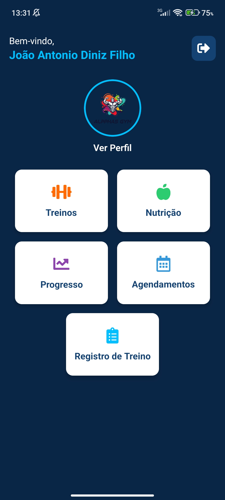
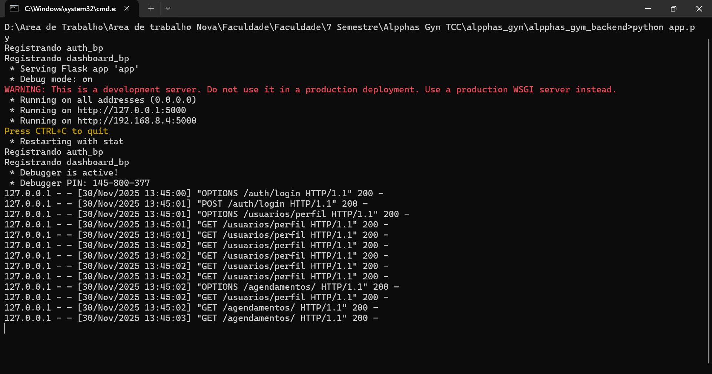

# 🏋️‍♂️ Alpphas GYM — Sistema Integrado de Gestão Fitness  
**Projeto de Conclusão de Curso – Engenharia de Software – UNIGRAN**

O **Alpphas GYM** é um sistema completo para academias, personal trainers, nutricionistas e alunos, desenvolvido com arquitetura cliente-servidor e aplicações multiplataforma (Desktop, Mobile e API).  
O objetivo é proporcionar um ambiente unificado para gestão de treinos, planos alimentares, avaliações físicas, agendamentos e acompanhamento da evolução dos alunos.

Este repositório reúne **todo o ecossistema do sistema**, incluindo:

- Backend (API Flask)
- Aplicação Desktop (Tauri + React + Vite)
- Aplicação Mobile (Expo + React Native)
- Estrutura do Banco de Dados (MySQL)
- Documentação técnica destinada ao TCC

---

# 📌 1. Visão Geral do Sistema

O Alpphas GYM foi projetado para atender três perfis principais:

### 👤 **Alunos**
- Visualização de treinos
- Execução e registro de treinos
- Acompanhamento de avaliações físicas
- Consulta e cancelamento de agendamentos
- Acesso a planos alimentares
- Visualização de progresso via gráficos

### 💪 **Personais Trainers**
- Criação e gestão de treinos
- Avaliações físicas completas
- Registros de treino dos alunos
- Gestão de exercícios
- Gestão de agendamentos

### 🥗 **Nutricionistas**
- Criação e edição de planos alimentares
- Avaliações físicas
- Gestão de agendamentos

### 🛠️ **Administrador**
- Gestão geral de usuários
- Monitoramento de logs
- Controle estrutural do sistema

---

# 🏗️ 2. Arquitetura do Projeto

O sistema segue uma **arquitetura Cliente-Servidor**, onde:

- O **Backend Flask** fornece uma API REST consumida pelo Desktop e Mobile.
- A aplicação **Desktop (Tauri)** serve como plataforma de gestão para ambientes Windows.
- A aplicação **Mobile (Expo)** permite acesso rápido de alunos e profissionais.
- Banco de dados **MySQL** armazena todas as entidades e relacionamentos.

### 📌 Tecnologias principais  
**Backend**
- Python, Flask, JWT, Flask-Login, Flask-CORS  
- PyMySQL, bcrypt, python-dotenv  
- ReportLab (PDFs), Requests, Pytz, Gunicorn  

**Desktop**
- React + Vite  
- Tauri (Rust + Webview)  
- TailwindCSS  

**Mobile**
- Expo (React Native)  
- React Navigation  
- Axios  
- Expo Print / Sharing  
- Chart-Kit  

**Banco de Dados**
- MySQL 8.x  
- Modelagem relacional  
- Relacionamentos 1:N e N:N  

---

# 📁 3. Estrutura do Repositório

```
/alpphas_backend           → API Flask (rotas, serviços, modelos, config)
/alpphas_desktop           → Aplicação Desktop (React + Tauri)
/alpphas_mobile            → Aplicação Mobile (Expo + React Native)
/database                  → Scripts SQL, diagramas e documentação
README.md                  → Este arquivo
.gitignore                 → Regras globais de versionamento
```

---

# 🚀 4. Como Executar o Projeto

## 🔧 4.1 Backend (Flask)
```
cd alpphas_backend
pip install -r requirements.txt
python app.py
```

Certifique-se de configurar o arquivo `.env` com:

```
DB_HOST=localhost
DB_USER=root
DB_PASSWORD=****
DB_NAME=alpphas_gym
SECRET_KEY=****
JWT_SECRET_KEY=****
```

---

## 🖥️ 4.2 Aplicação Desktop
```
cd alpphas_desktop
npm install
npm run tauri dev
```

---

## 📱 4.3 Aplicação Mobile (Expo)
```
cd alpphas_mobile
npm install
npx expo start
```

Para gerar APK (modo testing):
```
npx expo export:android
```

---

# 🗄️ 5. Banco de Dados

Tudo relacionado à modelagem está em:

```
/database
```

Incluindo:

- `schema.sql`
- diagramas ER
- documentação de tabelas
- relacionamentos

---

# 🧪 6. Testes

O projeto utiliza:

- Testes da API com ferramentas internas
- Validação manual de fluxos críticos
- Testes de usabilidade aplicados a 8 usuários  
  (2 personal trainers, 2 nutricionistas e 4 alunos)

A documentação completa desses testes se encontra no TCC.

---

# 📸 7. Prints do Sistema


```



```

---

# 🎓 8. Créditos do Projeto (TCC)

**Autor:** João Antonio Diniz Filho  
**Curso:** Engenharia de Software  
**Instituição:** UNIGRAN – Universidade da Grande Dourados  
**Ano:** 2025  

Orientador: *[Marcos Alves Mariano]*

---

# 🏁 9. Licença

Este projeto é de uso acadêmico e não possui fins comerciais.  
Redistribuição permitida somente mediante autorização.

---

# 📬 10. Contato

Caso deseje mais informações sobre o projeto:

```
joaoantoniodinizfilho@gmail.com
LinkedIn: www.linkedin.com/in/joao-antonio-diniz-filho
```

---

⭐ Se este repositório foi útil para sua avaliação, considere deixar uma estrela!

# tcc
