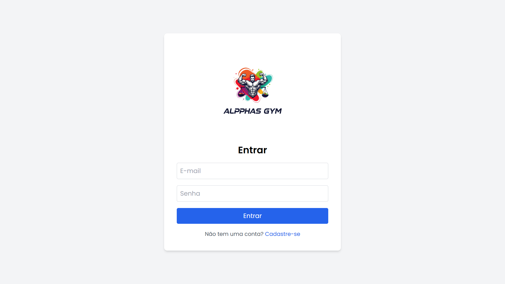
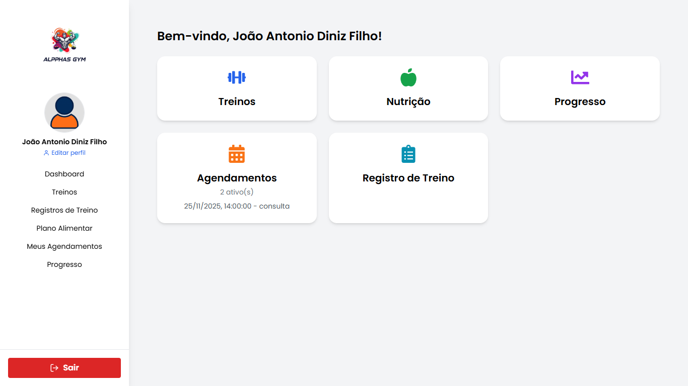
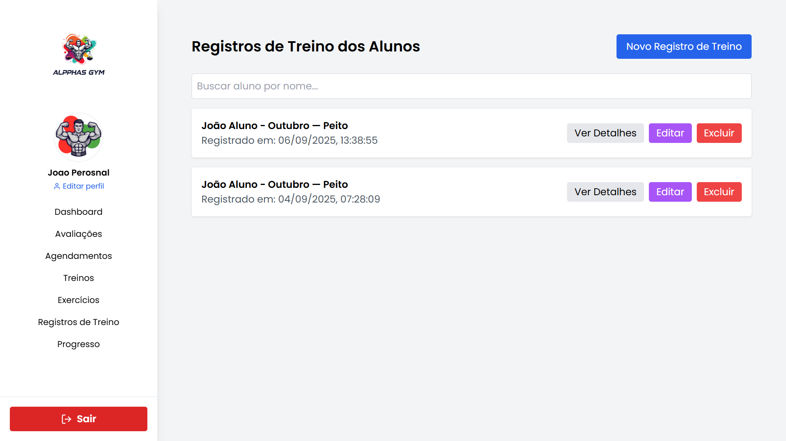

# 🖥️ Alpphas GYM – Aplicação Desktop (React + Vite + Tauri)

Esta pasta contém o **frontend desktop** do sistema Alpphas GYM, desenvolvido com **React**, **Vite** e **Tauri** para fornecer uma aplicação leve, rápida e integrada ao sistema operacional Windows.

A aplicação desktop é utilizada principalmente por **administradores**, **personais** e **nutricionistas**, oferecendo uma interface completa para gestão de treinos, alunos, agendamentos, avaliações e planos alimentares.

---

# 🚀 1. Tecnologias Utilizadas

- **React 18**
- **Vite**
- **Tauri (Rust + WebView)**
- **TailwindCSS**
- **Axios**
- **React Router**
- **LocalStorage / JWT**
- **Context API**

---

# 📁 2. Estrutura de Pastas

```
/alpphas_desktop
 ├── src/
 │   ├── components/          → Componentes reutilizáveis
 │   ├── pages/               → Telas principais
 │   ├── services/            → API (Axios)
 │   ├── context/             → Autenticação e estado global
 │   ├── assets/              → Imagens, ícones e fontes
 │   └── main.jsx             → Arquivo inicial
 ├── src-tauri/               → Configurações do Tauri
 ├── index.html
 ├── package.json
 ├── vite.config.js
 └── tauri.conf.json
```

---

# 🔧 3. Instalação

## 3.1 Instalar dependências
```
npm install
```

---

# ▶️ 4. Executando em modo desenvolvimento

```
npm run tauri dev
```

Isso irá:

- iniciar o servidor Vite  
- abrir a aplicação desktop com Tauri  
- integrar o backend automaticamente  

---

# 📦 5. Build para Windows (.EXE)

```
npm run tauri build
```

O instalador final será gerado em:

```
src-tauri/target/release
```

---

# 🔐 6. Integração com o Backend

A aplicação consome a API Flask via Axios.

O arquivo que define a URL base está em:

```
src/services/api.js
```

Exemplo:

```js
export default axios.create({
  baseURL: "http://127.0.0.1:5000"
});
```

> Certifique-se de que o **backend esteja rodando** antes de iniciar o desktop.

---

# 🎨 7. Estilos e Layout

Utiliza:

- **TailwindCSS**
- Componentes reutilizáveis
- Layout responsivo
- Ícones via `react-icons`

---

# 🔐 8. Autenticação

A autenticação é realizada através de:

- **JWT**
- Armazenamento no `localStorage`
- Proteção de rotas
- Redirecionamento automático em expiramento de sessão

---

# 🧪 9. Testes

### Testes realizados:
- Renderização das páginas
- Comunicação com o backend
- Carregamento de dashboards
- Manuseio de erros de rede
- Testes completos de fluxo de login e logout

---

# 🛠️ 10. Scripts disponíveis

```
npm run dev          → modo desenvolvimento
npm run build        → build do Vite
npm run preview      → visualizar build web
npm run tauri dev    → desktop em dev
npm run tauri build  → gerar .exe final
```

---

# 📸 11. Prints da Aplicação


```



```

---

# 🏁 12. Autor

Desenvolvido por **João Antonio Diniz Filho**  
Parte integrante do TCC – **UNIGRAN 2025**

---

```
🖥️ Aplicação Desktop estável e integrada ao backend Alpphas GYM.
```

