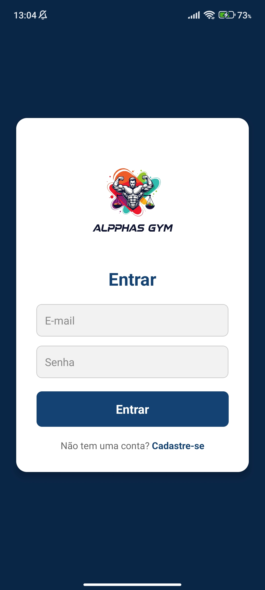
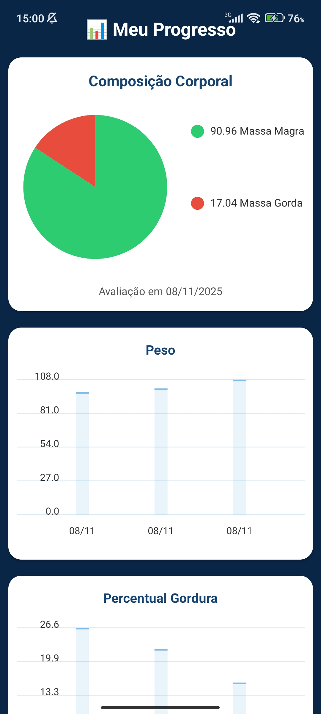

# 📱 Alpphas GYM – Aplicação Mobile (Expo + React Native)

A aplicação mobile do **Alpphas GYM** foi desenvolvida utilizando **Expo**, **React Native** e integração direta com o backend Flask.  
Ela é destinada principalmente aos **alunos**, **personais** e **nutricionistas**, oferecendo acesso rápido a treinos, avaliações, progresso físico, agendamentos e planos alimentares.

---

# 🚀 1. Tecnologias Utilizadas

- **Expo (SDK 54+)**
- **React Native 0.79+**
- **React Navigation**
- **Axios**
- **AsyncStorage**
- **Expo Print & Sharing**
- **react-native-chart-kit**
- **Expo Router (opcional)**
- **Context API (Autenticação)**

---

# 📁 2. Estrutura de Pastas

```
/alpphas_mobile
 ├── app/                      → Rotas e telas
 │   ├── login/
 │   ├── dashboard/
 │   ├── treinos/
 │   ├── progresso/
 │   ├── agendamentos/
 │   └── planoAlimentar/
 ├── components/              → Componentes reutilizáveis
 ├── services/                → API Axios
 ├── assets/                  → Ícones e imagens
 ├── utils/                   → Helpers e funções úteis
 ├── App.js                   → Arquivo inicial
 ├── package.json
 └── README.md                → Este arquivo
```

---

# 🔧 3. Instalação

## 3.1 Instalar dependências
```
npm install
```

---

# ▶️ 4. Executando em modo desenvolvimento

```
npx expo start
```

Você pode abrir:

- **Android físico** → via QR Code  
- **Android Studio** → via emulador  
- **Web** → opcional (não recomendado para testes reais)

---

# 📦 5. Gerar APK (modo testing)

Com Expo CLI:

```
npx expo export:android
```

O APK será gerado em:

```
/dist
```

> Ideal para testes em até 10 usuários (como no seu TCC).

---

# 🔐 6. Autenticação

A autenticação utiliza:

- **JWT**
- **Armazenamento no AsyncStorage**
- **Interceptores Axios para sessões**
- **Redirecionamento automático quando token expira**

Arquivo principal:

```
/services/api.js
```

Exemplo:

```js
export default axios.create({
  baseURL: "http://SEU_IP_LOCAL:5000"
});
```

---

# 📊 7. Módulo de Progresso (Destaque do App)

O módulo de progresso renderiza gráficos:

- **Pizza** (percentual de gordura / massa magra)  
- **Barras** (evolução de medidas)  

Utilizando:

```
react-native-chart-kit
```

Dados consumidos da rota:

```
GET /avaliacoes/evolucao/:id_aluno
```

---

# 🧪 8. Testes Realizados

- Testes de navegação React Navigation  
- Renderização de gráficos  
- Fluxo completo de login  
- Busca de aluno com atualização automática  
- Registros de treino  
- Agendamentos (visualização/cancelamento)  
- Impressão de PDF (planos alimentares)

---

# 🛠️ 9. Scripts Disponíveis

```
npm start            → iniciar projeto
npm run android      → abrir no emulador
npm run web          → modo web
npx expo start       → iniciar Metro Bundler
npx expo export:android → gerar APK
```

---

# 📸 10. Prints da Aplicação


```




```

---

# 🏁 11. Autor

Desenvolvido por **João Antonio Diniz Filho**  
Aplicativo mobile do sistema **Alpphas GYM – TCC UNIGRAN 2025**

---

```
📱 Aplicativo Mobile robusto, moderno e totalmente integrado ao backend Alpphas GYM.
```
