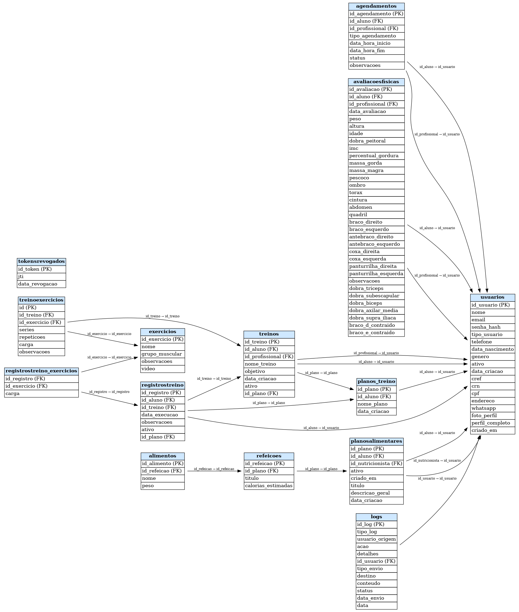

# 🗄️ Alpphas GYM – Banco de Dados (MySQL)

Este diretório contém a estrutura completa do banco de dados do **Alpphas GYM**, incluindo o schema, diagramas e documentos de apoio ao entendimento da modelagem de dados utilizada no sistema.

O banco foi projetado seguindo práticas de normalização, integridade referencial e otimização para operações de leitura/escrita utilizadas pelo backend em Flask.

---

# 📌 1. Tecnologias Utilizadas

- **MySQL 8.x**
- **InnoDB** (engine principal)
- **Chaves primárias e estrangeiras**
- **Relacionamentos 1:N e N:N**
- **Triggers (se aplicável)**
- **Procedures (se aplicável)**

---

# 🧱 2. Arquivos Incluídos

```
/database
 ├── schema.sql              → Estrutura completa das tabelas
 ├── diagrama.png            → Diagrama ER do banco
 ├── relacionamentos.pdf     → Documentação dos relacionamentos
 ├── dados-exemplo.sql       → (Opcional) Inserções para testes
 └── README.md               → Este arquivo
```

---

# 🧬 3. Visão Geral da Modelagem

O banco de dados é estruturado para atender quatro perfis principais:

- **Alunos**
- **Personais Trainers**
- **Nutricionistas**
- **Administrador**

E também entidades centrais como:

- Avaliações físicas  
- Treinos  
- Exercícios  
- Agendamentos  
- Planos alimentares  
- Refeições  
- Registros de treino  

---

# 🔗 4. Principais Relacionamentos

### 👤 **Usuários**
- `usuarios (1) -> (N) treinos`
- `usuarios (1) -> (N) planos_alimentares`
- `usuarios (1) -> (N) agendamentos`
- `usuarios (1) -> (N) avaliacoes_fisicas`

### 🏋️ **Treinos e Exercícios**
- `treinos (1) -> (N) exercicios`
- `exercicios (N) -> (N) registro_treino` *(se aplicável)*

### 🥗 **Planos Alimentares**
- `planos (1) -> (N) refeicoes`

### 📅 **Agendamentos**
- `usuarios (1) -> (N) agendamentos`
- `agendamentos` possuem status e lógica de controle via backend.

---

# 🛠️ 5. Importando o Banco

## 5.1 Criar banco no MySQL

```sql
CREATE DATABASE alpphas_gym CHARACTER SET utf8mb4 COLLATE utf8mb4_unicode_ci;
```

## 5.2 Importar schema:

```
mysql -u root -p alpphas_gym < schema.sql
```

Se estiver usando MySQL Workbench:

1. Abra o Workbench  
2. Selecione **Server → Data Import**  
3. Escolha **Import from Self-Contained File**  
4. Selecione `schema.sql`  
5. Execute o restore  

---

# 🧹 6. Convenções do Projeto

- Todas as tabelas utilizam **id INT AUTO_INCREMENT** como PK  
- Todas as FK seguem o padrão: `id_usuario`, `id_treino`, `id_plano`, etc.  
- Tabela `usuarios` possui o campo `tipo_usuario` (aluno, personal, nutri, admin)  
- Datas armazenadas em formato **DATETIME**  
- Campos booleanos representados via TINYINT (0/1)  
- Soft delete NÃO é utilizado (deleção real)  

---

# 📄 7. Descrição das Principais Tabelas

### 🧍 Tabela `usuarios`
- Armazena dados gerais  
- Senha armazenada via hash + bcrypt  
- Ligação com treinos, planos, avaliações, agendamentos  

### 🏋️ Tabela `treinos`
- Criados por personais  
- Associados a alunos  
- Podem ter múltiplos exercícios  

### 🗓️ Tabela `agendamentos`
- Horário, tipo de serviço (personal, nutri), status e profissional responsável  

### 🏋️‍♂️ Tabela `avaliacoes_fisicas`
- Peso, altura, IMC, gordura corporal, etc.  
- Consumida no módulo de progresso  

### 🥗 Tabela `planos_alimentares`
- Criados por nutricionistas  
- Podem possuir várias refeições  

---

# 📊 8. Diagrama do Banco (ER)




---

# 🐬 9. Acesso ao Banco no Backend

O backend se conecta via:

```
PyMySQL
```

E utiliza as variáveis no `.env`:

```
DB_HOST=
DB_USER=
DB_PASSWORD=
DB_NAME=
```

---

# 📝 10. Autor

Documentação do Banco – Projeto **Alpphas GYM**  
Autor: **João Antonio Diniz Filho**  
UNIGRAN – 2025

---

```
🗄️ Banco de dados otimizado e preparado para alto desempenho no sistema Alpphas GYM.
```
